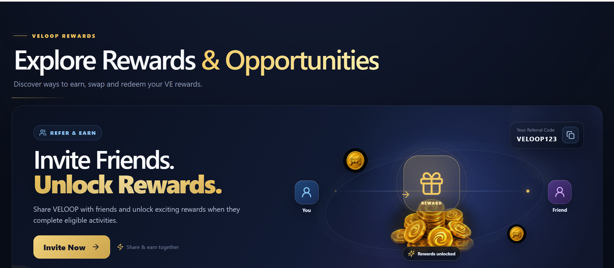
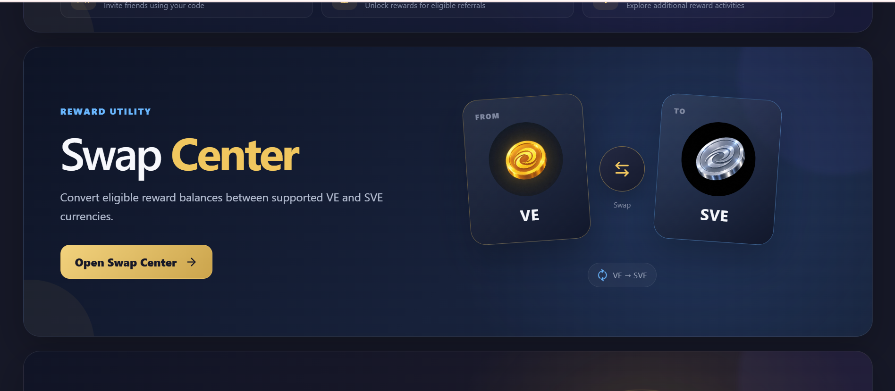
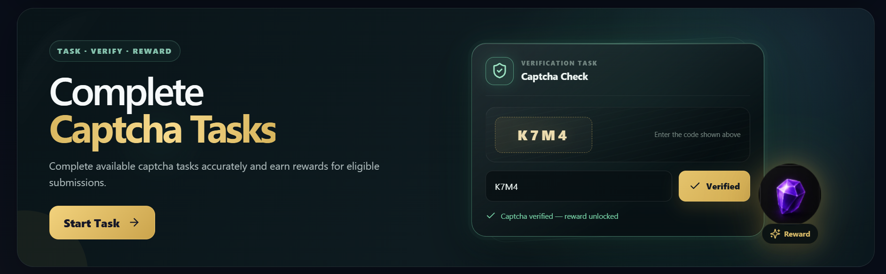

# VELOOP Rewards — Promotional Banner Experience

A responsive React-based landing page for **VELOOP Rewards**, featuring five distinct promotional banners for earning, swapping, completing tasks, and redeeming rewards.

The project focuses on a polished fintech-inspired visual system, responsive layouts, accessible interactions, and lightweight client-side interactions without requiring a backend.

## ✨ Features

- Five full-width responsive reward banners
- Distinct visual identity for each reward opportunity
- Responsive layouts for desktop, tablet, and mobile screens
- Interactive referral-code copy action
- Interactive VE ↔ SVE swap-direction control
- Bonus VE highlight interaction
- Functional captcha verification with success and error states
- Interactive reward-option selection in the Exchange Center
- Dedicated routes for each banner CTA
- Hover, active, focus, and selected states for interactive controls
- Keyboard-friendly focus states
- Accessible labels and status announcements for interactive elements
- Reduced-motion support through `prefers-reduced-motion`
- Reusable banner shell and CTA button components
- Demo data clearly identified where applicable

## 🎯 Reward Banners

### 1. Refer & Earn

Encourages users to invite friends to VELOOP Rewards.

**Interaction:**
- Displays a referral code
- Allows the user to copy the referral code
- Provides an invitation CTA

### 2. Swap Center

Presents the conversion of supported VE and SVE reward balances.

**Interaction:**
- Users can reverse the displayed swap direction
- The FROM/TO labels and reward visuals update dynamically

### 3. Bonus VEs

Highlights opportunities to earn additional VE rewards through eligible activities.

**Interaction:**
- Users can interact with the bonus VE visual
- A temporary highlight message communicates the interaction

### 4. Captcha Tasks

Represents a task → verification → reward flow.

**Interaction:**
- Users enter a captcha code
- Verification provides success or error feedback
- A successful verification displays a reward-unlocked state

> The captcha is a frontend demonstration only and is not connected to a backend verification service.

### 5. Exchange Center

Shows a redemption flow from a demo VE balance to supported reward options.

**Interaction:**
- Users can select between UPI, Gift Card, and Reward Card options
- The selected option is visually indicated
- The current selection is announced in the status area

> The displayed VE balance is demo data and does not represent an official reward balance.

## 🛠️ Tech Stack

- **React 19** — UI development
- **Vite 6** — development server and production build tooling
- **React Router** — client-side routing
- **CSS Modules** — component-scoped styling
- **Bootstrap 5** — base CSS utilities/styles
- **Lucide React** — interface icons
- **JavaScript (ES Modules)**

## 📁 Project Structure

```text
veloop-rewards-banners/
├── public/
│   └── screenshots/
│       ├── desktop-home.png
│       ├── swap-center.png
│       ├── mobile-home.png
│       └── captcha-verified.png
├── src/
│   ├── assets/
│   │   └── images/
│   │       ├── multi_SVEs.jpeg
│   │       ├── multi_VEs.jpeg
│   │       ├── multi_gems.jpeg
│   │       ├── multi_token.jpeg
│   │       ├── single_SVEs.jpeg
│   │       ├── single_VEs.jpeg
│   │       ├── single_gem.jpeg
│   │       └── ...
│   │
│   ├── components/
│   │   ├── BonusVEsBanner/
│   │   ├── CaptchaTasksBanner/
│   │   ├── ExchangeCenterBanner/
│   │   ├── ReferEarnBanner/
│   │   ├── SwapCenterBanner/
│   │   └── shared/
│   │       ├── BannerButton.jsx
│   │       └── RewardBannerShell.jsx
│   │
│   ├── pages/
│   │   ├── BonusPage.jsx
│   │   ├── CaptchaPage.jsx
│   │   ├── ExchangePage.jsx
│   │   ├── ReferPage.jsx
│   │   └── SwapPage.jsx
│   │
│   ├── App.jsx
│   ├── App.module.css
│   ├── index.css
│   └── main.jsx
│
├── .gitignore
├── index.html
├── package.json
├── package-lock.json
├── vite.config.js
└── README.md
```

## 🚀 Getting Started

### Prerequisites

- Node.js installed on your system
- npm installed with Node.js

### Installation

Clone the repository and enter the project directory:

```bash
git clone https://github.com/jainsidharth15/VELOOP-rewards-banners.git
cd VELOOP-rewards-banners
```

Install dependencies:

```bash
npm install
```

### Run the development server

```bash
npm run dev
```

Open the local URL displayed by Vite in your browser.

### Create a production build

```bash
npm run build
```

### Preview the production build

```bash
npm run preview
```

## 🔗 Routes

| Route | Purpose |
|---|---|
| `/` | Main VELOOP Rewards banner experience |
| `/refer` | Refer & Earn destination page |
| `/swap` | Swap Center destination page |
| `/bonus` | Bonus VEs destination page |
| `/captcha` | Captcha Tasks destination page |
| `/exchange` | Exchange Center destination page |

The banner CTAs use React Router navigation to move between the main experience and their respective destination pages.

## 📱 Responsive Design

The interface is designed to adapt across:

- Desktop screens
- Tablet screens
- Mobile screens

The banner layouts, typography, reward visuals, controls, and supporting content adjust at smaller breakpoints to maintain usability and visual hierarchy.

## ♿ Accessibility

Accessibility considerations included in the implementation:

- Meaningful `alt` text for relevant reward imagery
- Accessible labels for icon-only controls
- Keyboard-visible focus states
- Semantic buttons for interactive controls
- `aria-pressed` state for selectable reward options
- `aria-live` / `role="status"` feedback for captcha verification
- Reduced-motion support using `prefers-reduced-motion`
- Touch-friendly interactive controls

## 🎞️ Animation & Interaction Design

Each banner uses subtle motion or interaction to reinforce its purpose without relying on excessive continuous animation.

- **Refer & Earn:** floating reward/gift visual treatment and copy interaction
- **Swap Center:** animated status treatment and interactive swap direction
- **Bonus VEs:** reward highlight interaction and supporting visual motion
- **Captcha Tasks:** verification state transitions
- **Exchange Center:** balance/reward visual treatment and selectable redemption options

A reduced-motion media query is included so users who prefer reduced motion receive a less animated experience.

## 🎨 Design Approach

The visual system uses a dark fintech-inspired foundation with gold, blue, and purple accents. Each banner has its own visual concept while sharing common layout, typography, CTA, spacing, and interaction patterns.

The five concepts are intentionally separated as:

- **Refer & Earn** → sharing and rewards
- **Swap Center** → conversion
- **Bonus VEs** → additional rewards
- **Captcha Tasks** → verification
- **Exchange Center** → redemption

## 🖼️ Screenshots

### Desktop



### Swap Center



### Mobile


### Captcha Verification



## 🌐 Live Demo

[View Live Demo](https://veloop-rewards-banners.netlify.app)

## 📦 Repository

**GitHub Repository:** [VELOOP Rewards Banners](https://github.com/jainsidharth15/VELOOP-rewards-banners)

## 🔮 Scope & Notes

- This project is a frontend implementation and does not include a backend.
- Reward values and redemption information shown in the interface are demonstration data where applicable.
- The captcha interaction is a frontend simulation and is not a production security mechanism.
- The dedicated destination pages currently provide basic route-level content and navigation back to the main rewards experience.

## 👤 Author

**Name:** Sidharth Jain  
**Role:** Frontend Developer / Computer Science Graduate  
**GitHub:** https://github.com/jainsidharth15
**LinkedIn:** https://www.linkedin.com/in/sidharth-jain-r15

---

Built as a frontend development assignment for the VELOOP Rewards experience.
