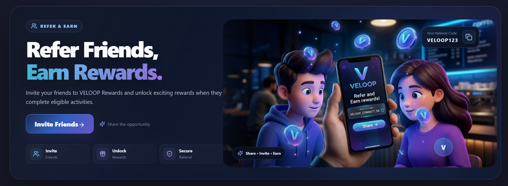
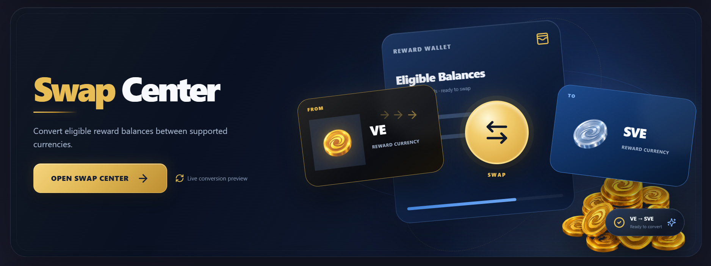
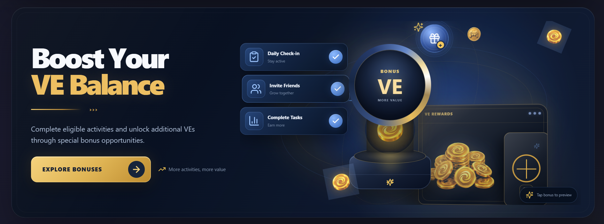
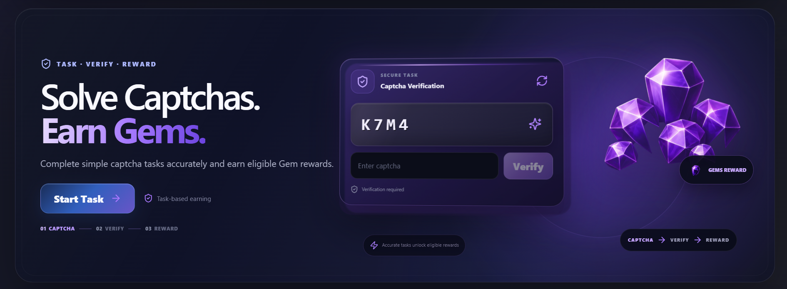
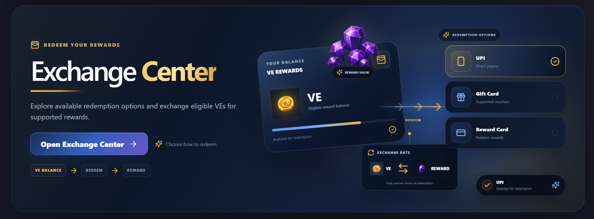
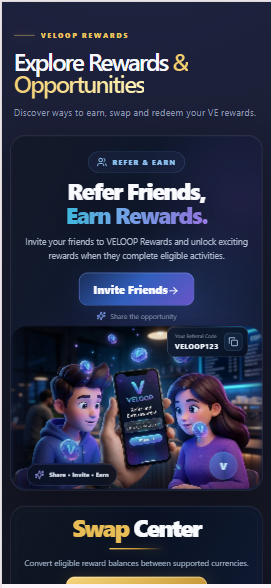
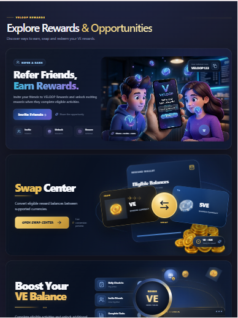
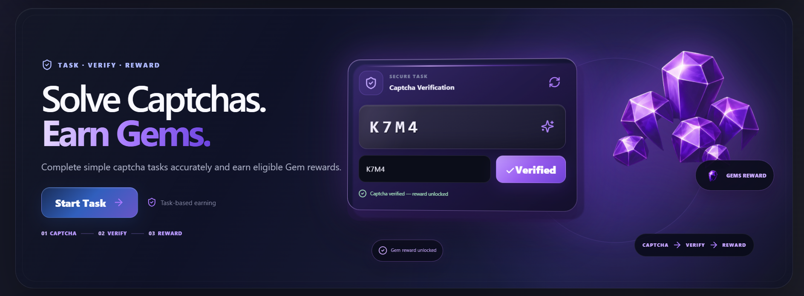

# VELOOP Rewards — Promotional & Feature Banner Experience

A responsive React-based promotional banner experience for **VELOOP Rewards**, featuring five reward-focused banner concepts with interactive UI states, route-based CTA destinations, responsive layouts, and a polished fintech-inspired visual system.

## ✨ Features

- Five responsive reward banners:
  - Refer & Earn
  - Swap Center
  - Bonus VEs
  - Captcha Tasks
  - Exchange Center
- Interactive referral-code copy action
- Interactive VE ↔ SVE swap-direction control
- Bonus VE interaction with visual feedback
- Captcha verification flow with success and error states
- Exchange Center reward-option selection
- Dedicated route-level pages for banner CTAs
- Responsive layouts for desktop, tablet, and mobile
- Reusable banner shell and CTA components
- Hover, active, focus, selected, and feedback states
- Keyboard-friendly interactions
- Accessible labels and status announcements
- Reduced-motion support through `prefers-reduced-motion`
- Frontend-only demo interactions with clearly identified demo data
- New reward-focused visual assets integrated into the banner experience

## 🎯 Project Overview

The project is designed around a set of promotional reward banners that communicate different VELOOP Rewards opportunities.

Each banner has its own visual concept and interaction while following a shared design system for layout, typography, spacing, CTA treatment, and responsive behavior.

### 1. Refer & Earn

Encourages users to invite friends to VELOOP Rewards.

**Interaction:**
- Displays a referral code
- Allows the referral code to be copied
- Provides an invitation CTA

### 2. Swap Center

Presents the conversion between supported VE and SVE reward balances.

**Interaction:**
- Users can reverse the displayed swap direction
- FROM/TO labels and reward visuals update dynamically

### 3. Bonus VEs

Highlights opportunities to earn additional VE rewards.

**Interaction:**
- Users can interact with the reward visual
- Feedback is displayed after the interaction

### 4. Captcha Tasks

Represents a task → verification → reward flow.

**Interaction:**
- Users enter a captcha code
- Verification returns success or error feedback
- Successful verification displays a reward-unlocked state

> The captcha is a frontend demonstration only and is not connected to a backend verification service.

### 5. Exchange Center

Demonstrates a redemption flow from a demo VE balance to available reward options.

**Interaction:**
- Users can select between UPI, Gift Card, and Reward Card options
- The selected option is visually indicated
- Selection feedback is communicated through the interface

> The displayed VE balance and reward values are demonstration data.

## 🛠️ Tech Stack

- **React 19** — UI development
- **Vite 6** — development server and build tooling
- **React Router** — client-side routing
- **CSS Modules** — component-scoped styling
- **Bootstrap 5** — CSS utilities and base styling
- **Lucide React** — interface icons
- **JavaScript (ES Modules)**

## 📁 Project Structure

```text
VELOOP-rewards-banners/
├── public/
│   └── screenshots/
│       ├── desktop-refer.png
│       ├── desktop-swap.png
│       ├── desktop-bonus.png
│       ├── desktop-captcha.png
│       ├── desktop-exchange.png
│       ├── mobile-overview.png
│       ├── tablet-overview.png
│       └── captcha-verified.png
│
├── src/
│   ├── assets/
│   │   └── images/
│   │       ├── SVE_clean.png
│   │       ├── VE_clean.png
│   │       └── transparent_coins_preview.png
│   │
│   ├── components/
│   │   ├── BonusVEsBanner/
│   │   ├── CaptchaTasksBanner/
│   │   ├── ExchangeCenterBanner/
│   │   ├── ReferEarnBanner/
│   │   ├── SwapCenterBanner/
│   │   └── shared/
│   │       ├── BannerButton.jsx
│   │       ├── BannerButton.module.css
│   │       ├── RewardBannerShell.jsx
│   │       └── RewardBannerShell.module.css
│   │
│   ├── pages/
│   │   ├── BonusPage.jsx
│   │   ├── CaptchaPage.jsx
│   │   ├── ExchangePage.jsx
│   │   ├── ReferPage.jsx
│   │   └── SwapPage.jsx
│   │
│   ├── App.jsx
│   ├── App.module.css
│   ├── index.css
│   └── main.jsx
│
├── .gitignore
├── index.html
├── package.json
├── package-lock.json
├── vite.config.js
└── README.md
```

## 🚀 Getting Started

### Prerequisites

Make sure the following are installed:

- [Node.js](https://nodejs.org/)
- npm (included with Node.js)

### Installation

Clone the repository:

```bash
git clone https://github.com/jainsidharth15/VELOOP-rewards-banners.git
```

Enter the project directory:

```bash
cd VELOOP-rewards-banners
```

Install dependencies:

```bash
npm install
```

### Run the Development Server

Start the Vite development server:

```bash
npm run dev
```

Open the local URL shown in the terminal, usually:

```text
http://localhost:5173/
```

### Create a Production Build

```bash
npm run build
```

### Preview the Production Build

```bash
npm run preview
```

## 🔗 Routes

| Route | Purpose |
|---|---|
| `/` | Main VELOOP Rewards banner experience |
| `/refer` | Refer & Earn destination |
| `/swap` | Swap Center destination |
| `/bonus` | Bonus VEs destination |
| `/captcha` | Captcha Tasks destination |
| `/exchange` | Exchange Center destination |

The banner CTAs use React Router navigation to move between the main experience and the corresponding destination pages.

## 📱 Responsive Design

The interface is designed to adapt across:

- Desktop
- Tablet
- Mobile

Layouts, typography, reward visuals, controls, spacing, and supporting content adjust at responsive breakpoints to maintain usability and visual hierarchy.

## ♿ Accessibility

The implementation includes:

- Meaningful `alt` text for relevant imagery
- Accessible labels for icon-only controls
- Keyboard-visible focus states
- Semantic buttons for interactive controls
- `aria-pressed` states for selectable options
- `aria-live` / `role="status"` feedback where appropriate
- Reduced-motion support using `prefers-reduced-motion`
- Touch-friendly interactive controls

## 🎞️ Interaction & Animation

The banners use purposeful interaction and subtle motion rather than excessive continuous animation.

| Banner | Interaction |
|---|---|
| Refer & Earn | Referral-code copy interaction and reward-focused visual treatment |
| Swap Center | Interactive swap direction and dynamic FROM/TO states |
| Bonus VEs | Reward highlight interaction and visual feedback |
| Captcha Tasks | Verification state transitions |
| Exchange Center | Selectable redemption options and balance/reward feedback |

Users who prefer reduced motion receive a less animated experience through the included `prefers-reduced-motion` handling.

## 🎨 Design Approach

The project uses a dark, fintech-inspired visual foundation with blue, gold, purple, white, and neutral accents.

The five banner concepts are intentionally differentiated:

- **Refer & Earn** → sharing and rewards
- **Swap Center** → conversion
- **Bonus VEs** → additional rewards
- **Captcha Tasks** → verification
- **Exchange Center** → redemption

Despite their individual visual identities, the banners share consistent CTA styling, spacing, typography, interaction patterns, and responsive behavior.

## 🖼️ Screenshots

### Refer & Earn



### Swap Center



### Bonus VEs



### Captcha Tasks



### Exchange Center



### Mobile Overview



### Tablet Overview



### Captcha Verification



## 🌐 Live Demo

**Live Website:**  
https://veloop-rewards-banners.netlify.app

## 📦 Repository

**GitHub Repository:**  
https://github.com/jainsidharth15/VELOOP-rewards-banners

## 🔒 Scope & Notes

- This is a frontend implementation and does not include a backend.
- Reward values and redemption information are demonstration data.
- The captcha interaction is a frontend simulation and is not a production security mechanism.
- The displayed reward balance is demo data and does not represent an official VELOOP account balance.
- External services are not required for the core banner interactions.

## 👤 Author

**Sidharth Jain**  
Frontend Developer / Computer Science Graduate

- GitHub: https://github.com/jainsidharth15
- LinkedIn: https://www.linkedin.com/in/sidharth-jain-r15

---

Built as a frontend development project for the **VELOOP Rewards** promotional banner experience.
